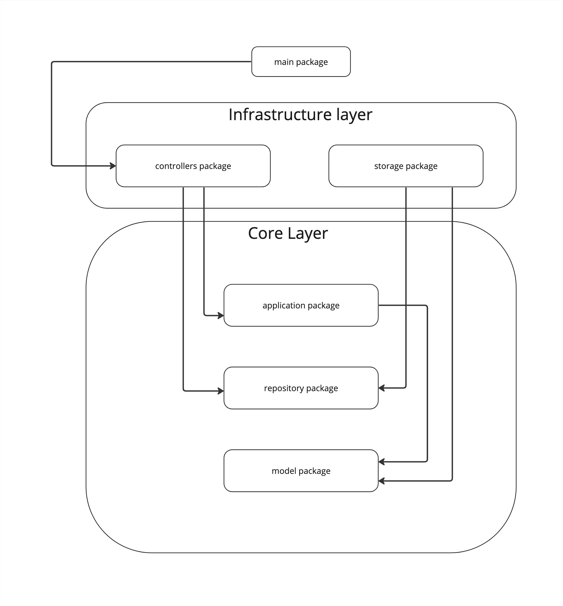

# Banner-API
> [Russian version](README_RUS.md)

## Description
This service is to show specific banner for user depends on its `feature` and `tag` parameters. Also it is provided interface to manage banners, its content, tags and features.  

## Arcitecture
The web application architecture include two main layers: Core and Infrastructure. Core is lower than Infrastructure, so code from Infrastructure can call code of Core but not vice versa. This also applies to internal layers components located vertically. And this reflects directories tree inside `src`.  
As it can be seen, the Repository pattern applied here.  The `repository` package contains `IRepository` interface that is used by `application` package which is presented the main logic. `model` package contains structures representing banners, features, tags and users. `storage` package includes PostgreSQL connector and implements `IRepository` interface to make possible its injection into application as a database. `controllers` package is API implementation which contains the logic for processing requests.
  
  
  
## Run
Application deploying is made with docker-compose. So it is necessary to have it installed before running.
The service starting requires environment variables defined in `.env` file. The example of all necessary variables is in `env-example` file. It is reccomend to create file with these variables manualy. In case the `.env` is missing it will be created from `env-example` automatically at startup.  
As it can be seen from `env-example` file, application will start on `localhost:8080` and web `adminer` to manage PostgreSQL database on `localhost:8888`.  
There are the next commands for `Makefile` allows to steer service running.
```sh
# run service and testing
make

# run testing (totally failed in case service is down)
make test

# run service
make run

# stop service
make stop

# stop and remove containers data (do not removes docker volume)
make clean
```
  
## Examples
Examples of requests represented as [Postman collection](materials/Banner-API.postman_collection.json)
  